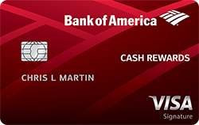
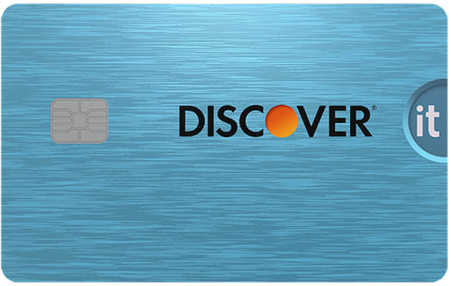

# 第一章 出國前代辦清單

在確認錄取通知後，將會陸續收到學校通知，也會有許多重要的代辦事項[^items]。來美國前需要籌備的東西包括：簽證、機票、整理攜帶物品、健康檢查以及規劃租屋。這些重要文件中，I-20（或DS-2019）以及護照中的學生簽證在畢業之前會緊密陪伴在留學生身邊[^student]。未來的出入入境、銀行開戶等等都會用到這些文件，請務必小心保管。這些重要文件中，I-20（或DS-2019）以及護照中的學生簽證在畢業之前會緊密陪伴在留學生身邊。未來的出入入境、銀行開戶等等都會用到這些文件，請務必小心保管。

[^student]: https://www.knowyourix.org/issues/statistics/
[^items]: https://www.rainn.org/statistics/campus-sexual-violence#:~:text=Women%20Ages%2018%2D24%20Are%20at%20an%20Elevated%20Risk%20of%20Sexual%20Violence&text=Among%20undergraduate%20students%2C%2026.4%25%20of,force%2C%20violence%2C%20or%20incapacitation.&text=5.8%25%20of%20students%20have%20experienced%20stalking%20since%20entering%20college.

這些重要文件中，I-20（或DS-2019）以及護照中的學生簽證在畢業之前會緊密陪伴在留學生身邊。未來的出入入境、銀行開戶等等都會用到這些文件，請務必小心保管。

  

## 1.3 簽證

最後更新日期2020.05.15

以下敘述為F1與J1簽證申請。大致步驟可以參考[美國在台協會網頁](https://www.ait.org.tw/zhtw/visas-zh/nonimmigrant-visas-zh/apply-nonimmigrant-visa-6-steps-zh/)。不建議面簽後一個月內規劃出國，以免遇上行政審查而無法出國。

#### 線上填寫DS-160

至[線上系統](https://ceac.state.gov/genniv/)填寫，填寫完後列印出確認頁。主要填寫所需文件資訊：

1.  有效期限內的護照
    
2.  申請學校核發的I-20
    
3.  符合美簽規格（5x5公分）的照片電子檔
    
4.  在美國的住宿地址、電話
    

  

## 2.3 校外租屋

吳紀葶、林青億協編 | 最後更新日期2020.05.15

  

台灣學生校外租大多落於North Oakland、Shadyside、Squirrel Hill，為本篇主要介紹的三個區域。尋找房子，超市、藥妝店分布及交通是相當重要的考量因素。另外，學期間[Pitt](http://www.pittshuttle.com/)、[CMU](https://www.cmu.edu/parking/shuttle/index.html)白天有提供校車、CMU晚上提供[Escort校車](https://www.cmu.edu/police/Shuttle%2520and%2520Escort/Escort%2520Service.html)（行駛時間6:30 pm~6:30 am）。



  

### 4.3.2 三大電信公司

|  |  |  |  |
|--|--|--|--|
| 平均訊號滿意度 | 1 | 2 | 3 |
| 訊號覆蓋率    | 1 | 2 | 3 |
| 費用（貴）    | 1 | 2 | 3 |
| 網路技術      | CDMA | GSM | GSM |

  

### 5.3.2 無信用紀錄新手卡

有些是開戶後Branch申請，有些則可以網路申請，有些則需要SSN。無SSN不要亂填SSN申卡，盜用SSN是聯邦重罪。以下均無年費信用卡：

| | BoA Cash Rewards：無須SSN，須開戶後Branch申請5。現金回饋卡，自行指定一類別3%回饋（通常推薦線上購物），超市、大賣場2%，其他1%。使用Visa6通道，提供初中階卡7如延長保固等。|
| -- | -- |
| | Discover it：須SSN，網申，用他人Referral連結有額外開卡獎勵8。現金回饋卡，季度限定消費5%回饋，其他1%。無國際交易手續費9。第一年消費所有回饋x2。每年送$20（GPA > 3.0）。使用Discover通道10，除現金回饋外，未提供其他福利。 |

  

#### C. 福利

信用卡提供延長保固、購物保險、租車保險，高階卡亦旅遊險、免費機場貴賓室等，初階信用卡常見福利：

  
|  | 延長保固 Extended Warranty   持卡人透過信用卡全額購買具有保固的商品時，發卡機構會提供額外1倍保固時間 |
| --- | --- |
|  |  購物保障 Purchase Protection    持卡人透過信用卡購買的商品損壞 |

  
  

Reference

1. [Campus Sexual Violence: Statistics](https://www.rainn.org/statistics/campus-sexual-violence#:~:text=Women%20Ages%2018%2D24%20Are%20at%20an%20Elevated%20Risk%20of%20Sexual%20Violence&text=Among%20undergraduate%20students%2C%2026.4%25%20of,force%2C%20violence%2C%20or%20incapacitation.&text=5.8%25%20of%20students%20have%20experienced%20stalking%20since%20entering%20college.)

2. [Knowing your IX Statistics](https://www.knowyourix.org/issues/statistics/)

